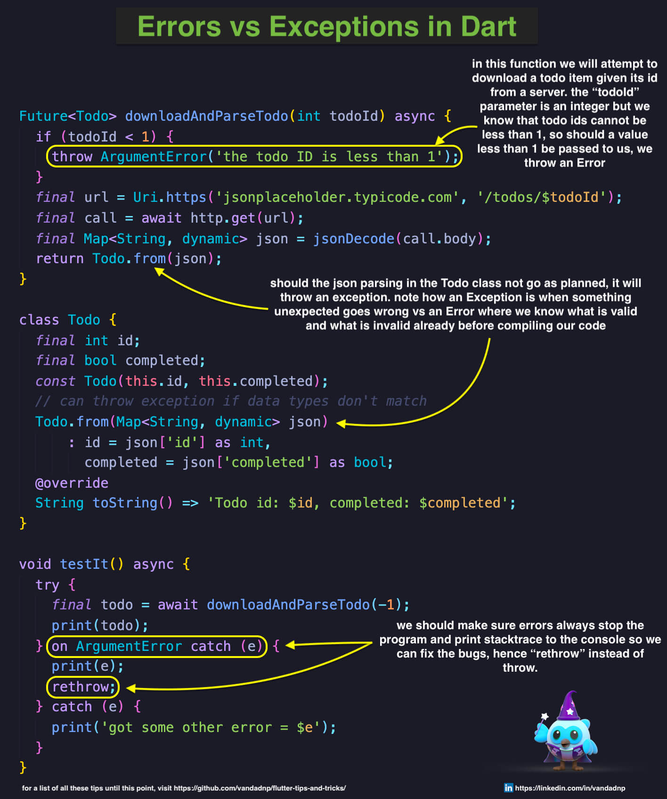

# Table of Contents

* [Data Streams Over HTTP/HTTPs in Dart](#data-streams-over-httphttps-in-dart)
* [Catching Nonexistent Accessors or Methods in Dart](#catching-nonexistent-accessors-or-methods-in-dart)
* [Using Expando in Dart](#using-expando-in-dart)
* [Implementing Custom Maps in Dart](#implementing-custom-maps-in-dart)
* [Dynamically Calling Functions in Dart](#dynamically-calling-functions-in-dart)
* [Factory Constructors in Dart](#factory-constructors-in-dart)
* [Calculating the Sum of List Items in Dart](#calculating-the-sum-of-list-items-in-dart)
* [Removing Duplicate Strings in Lists in Dart (Case-Insensitive)](#removing-duplicate-strings-in-lists-in-dart-case-insensitive)
* [Implementing Range in Dart](#implementing-range-in-dart)
* [Converting Lists to Maps in Dart](#converting-lists-to-maps-in-dart)
* [Implementing Hashable in Dart](#implementing-hashable-in-dart)
* [Random Name Generator in Dart](#random-name-generator-in-dart)
* [Capturing Stack Traces in Dart Exceptions](#capturing-stack-traces-in-dart-exceptions)
* [Removing Duplicates from Lists in Dart](#removing-duplicates-from-lists-in-dart)
* [Optional Spread Operator in Dart](#optional-spread-operator-in-dart)
* [Calling Optional Functions in Dart](#calling-optional-functions-in-dart)
* [Odd-Even Sort in Dart](#odd-even-sort-in-dart)
* [Implementing Zip and Tuples in Dart](#implementing-zip-and-tuples-in-dart)
* [Swapping Values in Lists with XOR in Dart](#swapping-values-in-lists-with-xor-in-dart)
* [Waiting for Multiple Futures in Dart](#waiting-for-multiple-futures-in-dart)
* [Using Queues as Stacks in Dart](#using-queues-as-stacks-in-dart)
* [Custom Iterators in Dart](#custom-iterators-in-dart)
* [Iterables as Ranges + Transform in Dart](#iterables-as-ranges-and-transform-in-dart)
* [Errors vs Exceptions in Dart](#errors-vs-exceptions-in-dart)
* [Custom Annotations in Dart](#custom-annotations-in-dart)
* [Classes as Enums in Dart](#classes-as-enums-in-dart)
* [Spread Operator in Collection Literals in Dart](#spread-operator-in-collection-literals-in-dart)
* [`StreamBuilder` and `StreamController` in Dart](#streambuilder-and-streamcontroller-in-dart)
* [Almost Equal in Dart](#almost-equal-in-dart)
* [Enum Associated Values in Dart](#enum-associated-values-in-dart)
* [Implementing `Comparable` in Dart](#implementing-comparable-in-dart)
* [Implementing Custom Integer Types in Dart](#implementing-custom-integer-types-in-dart)
* [Custom Subscripts in Dart](#custom-subscripts-in-dart)
* [Dart List Enumeration with Index](#dart-list-enumeration-with-index)
* [Applying Mixins to Other Mixins in Dart](#applying-mixins-to-other-mixins-in-dart)
* [Parameter Types in Dart](#parameter-types-in-dart)
* [Custom Exceptions in Dart](#custom-exceptions-in-dart)
* [`rethrow`ing Exceptions in Dart](#rethrowing-exceptions-in-dart)
* [`mixin`s and JSON Parsing in Dart](#mixins-and-json-parsing-in-dart)
* [`mixin`s vs `abstract class`es in Dart](#mixins-vs-abstract-classes-in-dart)
* [Drawing Shapes in Flutter with `LayoutBuilder`, `CustomPaint` and `CustomPainter`](#drawing-shapes-in-flutter-with-layoutbuilder-custompaint-and-custompainter)
* [Generic Type Aliases in Dart](#generic-type-aliases-in-dart)
* [Callable Classes in Dart](#callable-classes-in-dart)
* [Synchronous Generators in Dart](#synchronous-generators-in-dart)
* [Implicit Interfaces in Dart](#implicit-interfaces-in-dart)
* [`const` Constructors in Dart](#do-you-know-how-const-constructors-work-in-dart)
* [`async`-`await` Over Raw `Future`s in Dart](#did-you-know-that-in-dart-it-is-actually-preferred-to-use-async-and-await-over-using-raw-futures)
* [Initializer List and Default Values as Convenience Intializers in Dart](#in-dart-you-can-use-a-combination-of-initializer-list-plus-default-values-for-your-class-member-fields-to-create-elegant-and-handy-convenience-initializers)
* [Extract Elements of Certain Type from Lists in Dart](#did-you-know-that-in-dart-you-can-extract-elements-of-a-certain-type-from-your-lists-using-the-wheretype-generic-function-instead-of-calculating-the-equality-yourselves)
* [Type Promotion in Dart](#do-you-know-about-type-promotion-in-dart)
* [Extract Minimum and Maximum Values in `List<num>` in Dart](#4-lines-of-dart-code-that-include-the-spread-operator-cascade-operator-generics-extensions-private-prefix-and-getters)
* [Functions as First Class Citizens in Dart](#functions-as-first-class-citizens-in-dart)

# Data Streams Over HTTP/HTTPs in Dart

# Catching Nonexistent Accessors or Methods in Dart

# Using Expando in Dart

# Implementing Custom Maps in Dart

# Dynamically Calling Functions in Dart

# Factory Constructors in Dart

# Calculating the Sum of List Items in Dart

# Removing Duplicate Strings in Lists in Dart (Case-Insensitive)

# Implementing Range in Dart

# Converting Lists to Maps in Dart

# Implementing Hashable in Dart

# Random Name Generator in Dart

# Capturing Stack Traces in Dart Exceptions

# Removing Duplicates from Lists in Dart

# Optional Spread Operator in Dart

# Calling Optional Functions in Dart

# Odd-Even Sort in Dart

# Implementing Zip and Tuples in Dart

# Swapping Values in Lists with XOR in Dart

# Waiting for Multiple Futures in Dart

# Using Queues as Stacks in Dart

# Custom Iterators in Dart

# Iterables as Ranges and Transform in Dart

# Errors vs Exceptions in Dart

# Custom Annotations in Dart

# Classes as Enums in Dart

# Spread Operator in Collection Literals in Dart

# `StreamBuilder` and `StreamController` in Dart

# Almost Equal in Dart

# Enum Associated Values in Dart

# Implementing `Comparable` in Dart

# Implementing Custom Integer Types in Dart

# Custom Subscripts in Dart

# Dart List Enumeration with Index

# Applying Mixins to Other Mixins in Dart

# Parameter Types in Dart

# Custom Exceptions in Dart

# `rethrow`ing Exceptions in Dart

# `mixin`s and JSON Parsing in Dart

# `mixin`s vs `abstract class`es in Dart

# Drawing Shapes in Flutter with `LayoutBuilder`, `CustomPaint` and `CustomPainter`

# Generic Type Aliases in Dart

# Callable Classes in Dart

# Synchronous Generators in Dart

# Implicit Interfaces in Dart

Did you know that in #Dart, every #class implicitly exports an #interface that can be #implemented (as opposed to #extended) by other classes? This is called "implicit interface".

# Do you know how "const" constructors work in #Dart?

# Did you know that in #Dart, it is actually preferred to use #async and #await over using raw #Futures?

# In #Dart, you can use a combination of #Initializer #List plus default values for your class #member #fields to create elegant and handy convenience initializers

# Did you know that in #Dart, you can extract elements of a certain type from your Lists using the #whereType<T> #generic #function instead of calculating the #equality yourselves?
  

# Do you know about #Type #Promotion in Dart?

"address" is an optional field of the "Person" class. If you look at the "doThis()" function you see that I'm saving the value of address in a local variable and then comparing it with null and then returning if it's null. The Dart compiler is intelligent enough to understand that after the if-statement, "address" is NOT null anymore since you've already compared it with null and returned from the function.

If you look at the "insteadOfThis" function, the first one, the Dart compiler cannot make the same assumption if you don't first store the value of address in a local variable. In that first function the Dart compiler, even after the if-statement, needs you to refer to address as an optional, using "address?" syntax.

The mechanism the Dart compiler uses in the "doThis()" function is called Type Promotion.

# 4 lines of #Dart code that include the #spread operator, #cascade #operator, #generics, #extensions, #private prefix and #getters

# Functions as First Class Citizens in Dart

