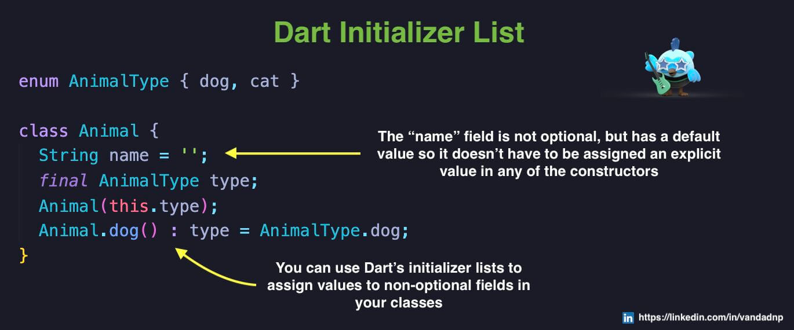

# Synchronous Generators in #Dart

# Implicit Interfaces in Dart

Did you know that in #Dart, every #class implicitly exports an #interface that can be #implemented (as opposed to #extended) by other classes? This is called "implicit interface".

# Do you know how "const" constructors work in #Dart?

# Did you know that in #Dart, it is actually preferred to use #async and #await over using raw #Futures?

# In #Dart, you can use a combination of #Initializer #List plus default values for your class #member #fields to create elegant and handy convenience initializers

# Did you know that in #Dart, you can extract elements of a certain type from your Lists using the #whereType<T> #generic #function instead of calculating the #equality yourselves?
  

# Do you know about #Type #Promotion in Dart?

"address" is an optional field of the "Person" class. If you look at the "doThis()" function you see that I'm saving the value of address in a local variable and then comparing it with null and then returning if it's null. The Dart compiler is intelligent enough to understand that after the if-statement, "address" is NOT null anymore since you've already compared it with null and returned from the function.

If you look at the "insteadOfThis" function, the first one, the Dart compiler cannot make the same assumption if you don't first store the value of address in a local variable. In that first function the Dart compiler, even after the if-statement, needs you to refer to address as an optional, using "address?" syntax.

The mechanism the Dart compiler uses in the "doThis()" function is called Type Promotion.

